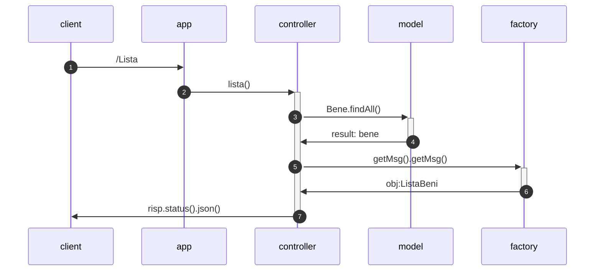
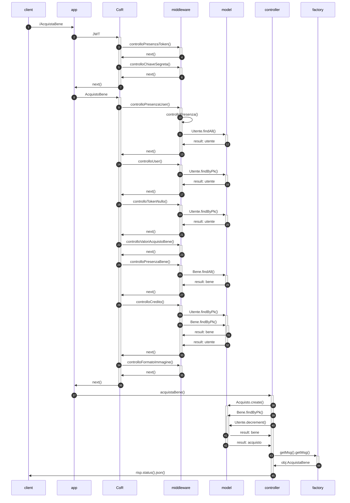
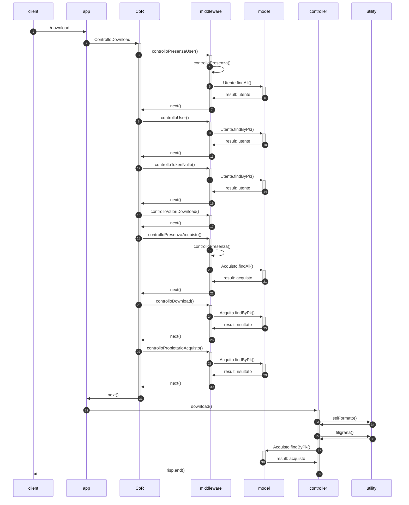
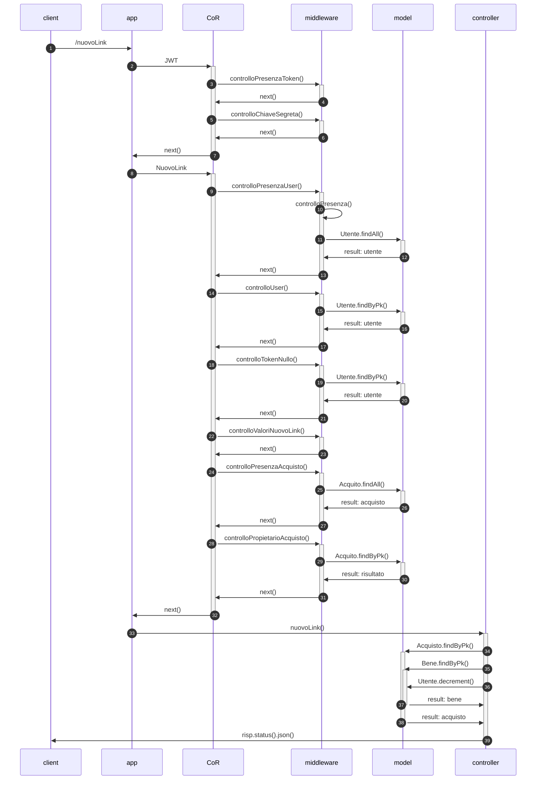
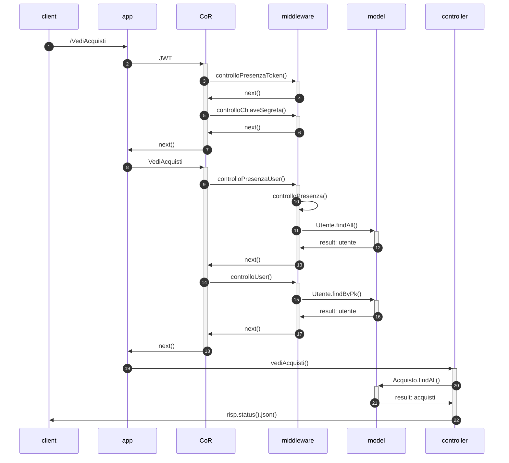
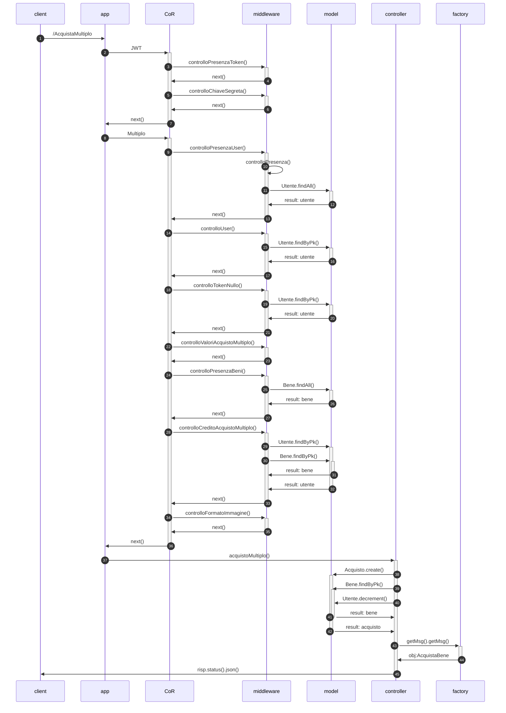
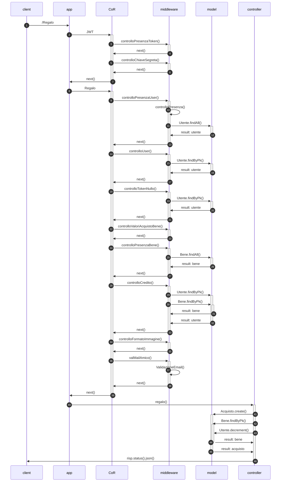
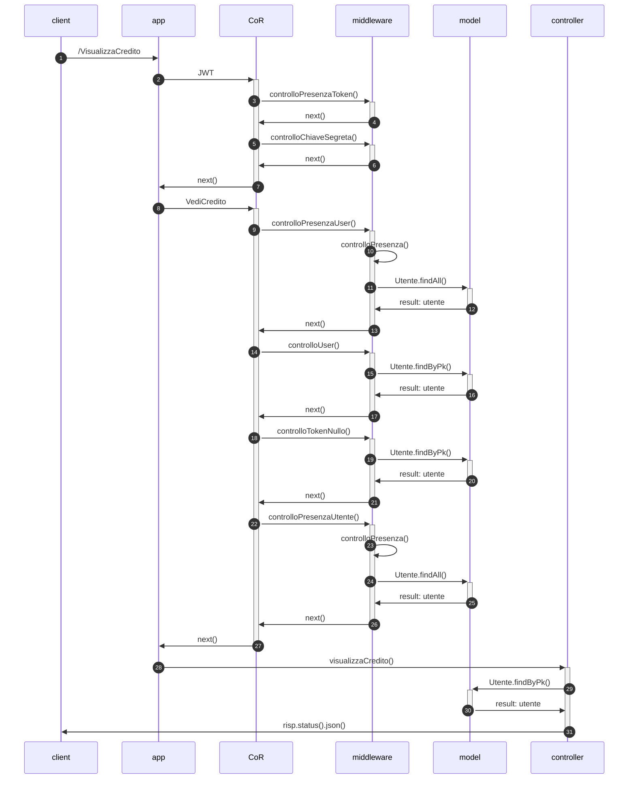
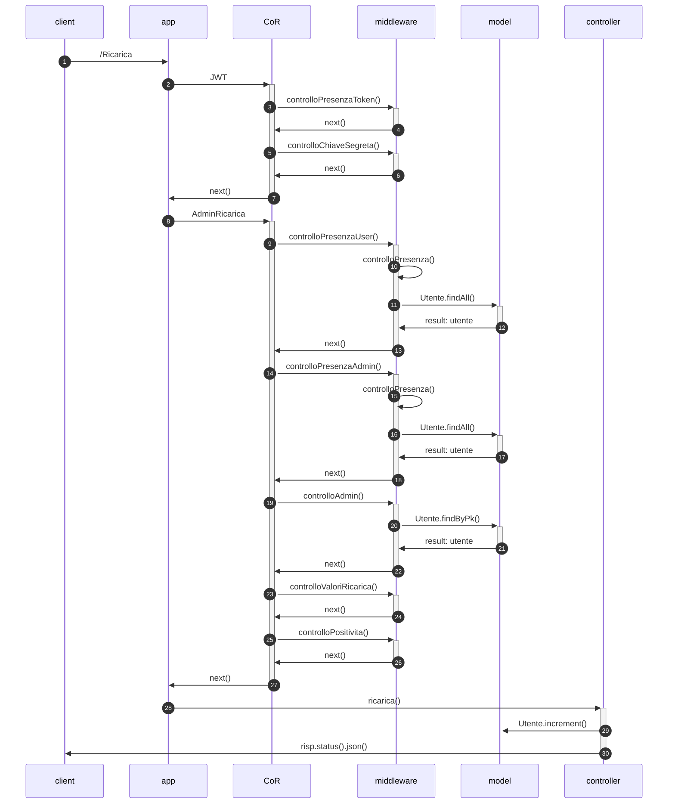
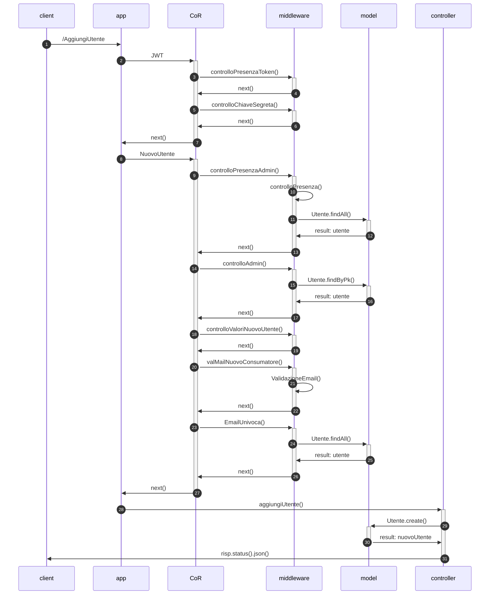

# Acquisto beni di interesse storico :framed_picture:	⛲  (Progetto PA)
## Descrizione del progetto
Il progetto consiste in un sistema che consenta di gestire l’acquisto di un prodotto digitale sotto forma di immagine relativo ad acquisizioni di bene di interesse storico (es. manoscritto, cartografia storica; ogni documento è caratterizzato da un preciso anno).
 
Ogni bene ha associato un costo in termini di token.

> `Nella cartella DocumentazioneAggiuntiva si può trovare ulteriore documentazione relativa al codice.`
 
## Funzioni del sistema
<table align="center">
    <thead>
        <tr>
            <th>Token</th>
            <th>Funzioni</th>
            <th>Ruolo</th>
        </tr>
    </thead>
    <tbody>
        <tr>
            <td>senza token</td>
            <td>Ottenere la lista dei beni disponibili (per tipologia o per anno)</td>
         <td>general</td>
        </tr>
        <tr>
            <td rowspan=8>con token</td>
            <td>Effettuare l’acquisto di uno specifico bene </td>
         <td>user</td>
        </tr>
        <tr>
            <td>Scaricare il bene acquistato</td>
         <td>user</td>
        </tr>
     <tr>
            <td>Visualizzare l’elenco degli acquisti effettuati</td>
      <td>user</td>
        </tr>
          <tr>
            <td>Effettuare acquisti multipli</td>
           <td>user</td>
        </tr>
          <tr>
            <td>Fare un regalo ad un amico</td>
           <td>user</td>
        </tr>
          <tr>
            <td>Visualizzare il credito</td>
           <td>user</td>
        </tr>
          <tr>
            <td>Ricaricare i crediti</td>
           <td>admin</td>
        </tr>
        <tr>
            <td>Aggiungere un utente</td>
           <td>admin</td>
        </tr>
    </tbody>
</table>


Ogni funzione è associata ad una diversa richiesta HTTP (POST o GET), per alcune delle quali è prevista un'autenticazione tramite token JWT.

## Rotte
La seguente tabella mostra le richieste possibili:

<table align="center">
    <thead>
        <tr>
            <th>Tipo</th>
            <th>Rotta</th>
        </tr>
    </thead>
    <tbody>
        <tr>
         <td> GET </td>
         <td> /ListaBeni </td>
        </tr>
        <tr>
         <td> GET </td>
         <td> /Lista </td>
        </tr>
         <tr>
         <td> POST </td>
         <td> /AcquistaBene </td>
        </tr>
         <tr>
         <td> GET </td>
         <td> /download/:bene/:formato/:tipoDownload/:idAcquisto </td>
        </tr>
        <tr>
         <td> POST </td>
         <td> /NuovoLink </td>
        </tr>
         <tr>
         <td> GET </td>
         <td> /VediAcquisti </td>
        </tr>
         <tr>
         <td> POST </td>
         <td> /AcquistaMultiplo </td>
        </tr>
        <tr>
         <td> POST </td>
         <td> /Regalo </td>
        </tr>
        <tr>
         <td> GET </td>
         <td> /VisualizzaCredito </td>
        </tr>
        <tr>
         <td> POST </td>
         <td> /Ricarica </td>
        </tr>
             <tr>
         <td> POST </td>
         <td> /AggiungiUtente </td>
        </tr>
    </tbody>
 </table>
 
### Visualizzazione dei beni (ListaBeni)
Mediante l'utilizzo di questa rotta si può visualizzare la lista di tutti i beni presenti. Questa rotta può essere richiamata da chiunque.

I filtri possono andare in AND, e si può filtrare per:
 - tipologia (manoscritti, cartografie storiche);
 - anno (relativo al bene di interesse storico).

Il payload deve essere inserito nel body della richiesta in formato JSON con la seguente struttura:

~~~
{
    "tipo":"manoscritto",
    "anno":355
}
~~~

### Visualizzazione di tutti i beni (Lista)
Mediante l'utilizzo di questa rotta si può visualizzare la lista di tutti i beni presenti. Questa rotta può essere richiamata da chiunque.

### Effettuare l'acquisto di uno specifico bene (AcquistaBene)
Mediante l'utilizzo di questa rotta si può acquistare un bene, specificandone l'id. Questa rotta può essere richiamata dall'utente autenticato, con il ruolo di user.

Se il credito è sufficiente viene restituito il bene sotto forma di immagine.

Nella richiesta deve essere specificato il formato di uscita, che può essere:
1. **jpg**;
2. **tiff**;
3. **png**.

Da effettuare tramite token JWT che deve contenere un payload JSON con la seguente struttura:

~~~
{
    "id_bene":1,
    "formato":"png",
    "consumatore":"luigiVerdi@alice.it",
    "ruolo":"user"
}
~~~

### Effettuare il download di un bene acquistato (download)
Mediante l'utilizzo di questa rotta si può scaricare il bene acquistato se il pagamento è effettuato con successo. Questa rotta può essere richiamata solamente dagli utenti autenticati con ruolo user. Il download andrà a buon fine solamente se l'utente che lo richiede risulta essere il proprietario di quell'acquisto.

Nota che il bene acquistato può essere scaricato solamente 1 volta; le richieste successive verranno rifiutate.

Da effettuare tramite token JWT che deve contenere un payload JSON con la seguente struttura:

~~~
{
    "consumatore":"rossiMario@gmail.com",
    "ruolo":"user"
}
~~~

### Richiedi nuovo link (NuovoLink)
Mediante l'utilizzo di questa rotta si può richiedere un nuovo link per un bene già scaricato. Il costo di questa operazione è di 1 token. Questa rotta può essere richiamata solamente dagli utenti autenticati, con ruolo user. La richiesta del nuovo link andrà a buon fine solo se l'utente che richiede il nuovo link risulta essere il proprietario di quell'acquisto.

Da effettuare tramite token JWT che deve contenere un payload JSON con la seguente struttura:

~~~
{
    "id_acquisto":1,
    "consumatore":"rossiMario@gmail.com",
    "ruolo":"user"
}
~~~

### Visualizzazione dei beni acquistati (VediAcquisti)
Mediante l'utilizzo di questa rotta si può visualizzare l’elenco degli acquisti effettuati per ogni utente. 
Gli acquisti saranno divisi per tipologia (download originale vs downloads aggiuntivi).

Questa rotta può essere richiamata solamente dall'utente autenticato con il ruolo di user.

Da effettuare tramite token JWT che deve contenere un payload JSON con la seguente struttura:

~~~
{
    "consumatore":"rossiMario@gmail.com",
    "ruolo":"user"
}
~~~

### Effettuare un acquisto multiplo (AcquistaMultiplo)
Mediante l'utilizzo di questa rotta si possono effettuare acquisti multipli. L'output sarà in questo caso uno zip.
Questa rotta può essere richiamata solamente dagli utenti autenticati, con ruolo user.

Da effettuare tramite token JWT che deve contenere un payload JSON con la seguente struttura:

~~~
{
    "ids": [1,2,3],
    "formato": "png",
    "consumatore": "giovi@alice.it",
    "ruolo":"user"
}
~~~

### Fare un regalo ad un amico (Regalo)
Mediante l'utilizzo di questa rotta si ha a possibilità di effettuare un regalo ad un “amico”, fornendo il suo indirizzo mail.
Questa rotta può essere richiamata solamente dagli utenti autenticati, con ruolo user.

Da effettuare tramite token JWT che deve contenere un payload JSON con la seguente struttura:

~~~
{
    "id_bene":2,
    "formato":"png",
    "email_amico":"ciao@ciao.it",
    "consumatore":"giovi@alice.it",
    "ruolo":"user"
}
~~~

### Visualizzare il credito (VisualizzaCredito)
Mediante l'utilizzo di questa rotta si può visualizzare il credito residuo di un utente.
Questa rotta può essere richiamata solamente dagli utenti autenticati, con ruolo user.

Da effettuare tramite token JWT che deve contenere un payload JSON con la seguente struttura:

~~~
{
    "consumatore":"rossiMario@gmail.com",
    "ruolo":"user"
}
~~~

### Effettuare la ricarica dei crediti (Ricarica)
Mediante l'utilizzo di questa rotta si può ricaricare il credito di un utente.
Questa rotta può essere richiamata solamente dagli utenti autenticati, con ruolo admin.

Da effettuare tramite token JWT che deve contenere un payload JSON con la seguente struttura:

~~~
{
    "email":"luigiVerdi@alice.it",
    "ricarica":700,
    "email_admin": "babiFre@alice.it",
    "ruolo":"admin"
}
~~~

### Aggiungere un nuovo utente (AggiungiUtente)
Mediante l'utilizzo di questa rotta l'admin può aggiungere un nuovo utente (con ruolo user).
Questa rotta può essere richiamata solamente dagli utenti autenticati, con ruolo admin.

Da effettuare tramite token JWT che deve contenere un payload JSON con la seguente struttura:

~~~
{
    "email": "gianni@alice.it",
    "username": "Giovalb",
    "nome": "Giovanni",
    "cognome": "Alberti",
    "email_admin": "babiFre@alice.it",
    "ruolo":"admin"
}
~~~

 #### Nel caso di token terminati da parte di un utente, l'accesso a tutte le rotte che richiedono l'autenticazione di Token JWT non sarà autorizzato, restituendo un Errore 401 - Non autorizzato.

## Diagrammi UML
### Use case
<p align="center">
  
</p>

### FlowChart
```mermaid
flowchart LR 
A[Client]-->|richiesta|B[app]
B[app]  -->  C{Rotta \n esistente?}  
 C  -- Si -->  D[Middleware]  
 D  -->  E{Middleware \n rispettati?}  
 E  --Si-->  F[app] 
  F --> H[controller]
  H -->M{Si verificano \n errori?}
  M --No--> L[messaggi di \n successo]
  M--Si-->G
  L --> Z
 E  -- No ----> G[messaggi \n di errore]
 G --> Z[risposta]
 C  -- No -->  G
 H --> J[singleton]
 J --> K[ORM \n Sequelize] 
 K --> Database 
 ```

### Sequence Diagram

#### Visualizzazione dei beni (ListaBeni)

```mermaid
sequenceDiagram
autonumber
client ->> app: /ListaBeni
app ->>+ CoR: FiltroTipoAnno
CoR ->>+ middleware: verificaContentType()
middleware ->>- CoR:  next()
CoR ->>+ middleware: controlloValoriFiltro()
middleware ->>- CoR:  next()
CoR ->>+ middleware: controlloTipoAnno()
middleware ->>- CoR:  next()
CoR ->>+ middleware: controlloTipo()
middleware ->>- CoR:  next()
CoR ->>+ middleware: controlloAnno()
middleware ->>+ model: Bene.findAll()
model ->>- middleware: result: bene
middleware ->>- CoR:  next()
CoR ->>- app : next()
app ->>+ controller: listaBeni()
controller ->>+ model : Bene.findAll()
model ->>- controller : result: bene
controller ->>+ factory : getMsg().getMsg()
factory ->>- controller: obj:ListaBeni
controller ->>- client:  risp.status().json()
```

#### Visualizzazione dei beni senza filtri (Lista)



#### Effettuare l'acquisto di uno specifico bene (AcquistaBene)



#### Effettuare il download di un bene acquistato (download)




#### Richiedi nuovo link (NuovoLink)



#### Visualizzazione dei beni acquistati (VediAcquisti)



#### Effettuare un acquisto multiplo (AcquistaMultiplo)



#### Fare un regalo ad un amico (Regalo)




#### Visualizzare il credito (VisualizzaCredito)



#### Effettuare la ricarica dei crediti (Ricarica)



#### Aggiungere un nuovo utente (AggiungiUtente)



## Pattern utilizzati

### Factory Method
Il factory method  è un pattern di progettazione creazionale che fornisce un’interfaccia per la creazione di oggetti in una superclasse, ma consente alle sottoclassi di modificare il tipo di oggetti che verranno creati.

Nel nostro progetto utilizziamo questo pattern per la creazione dei messaggi relativi allo stato dell'operazione che si vuole compiere, se questa va a buon fine verrà segnalato un successo, altrimenti un errore.

### Singleton
Il singleton è un design pattern creazionale che ha lo scopo di garantire che di una determinata classe venga creata una e una sola istanza, e di fornire un punto di accesso globale a tale istanza. 

Nel nostro progetto lo utilizziamo per effettuare la conNesione al database, in maniera tale che di essa vi sia una sola istanza così da non consumare iutilmente risorse computazionali.

### Chain Of Responsability & Middleware
La **catena di responsabilità** è un pattern comportamentale che consente di passare le richieste lungo una catena di gestori.
Alla ricezione di una richiesta, ciascun handler decide di elaborare la richiesta o di passarla al successivo handler della catena.

È molto simile ad un decoratore ma a differenza di quest’ultimo, la catena di responsabilità può essere interrotta.

La Catena di Responsabilità è formata da degli handler (funzioni o metodi), che hanno lo scopo di verificare se quello che gli viene passato soddisfa o meno dei criteri. Se il criterio è soddisfatto, non si ritorna, come avveniva nel Proxy, ma si va avanti passando il controllo all’handler successivo.

Le funzioni **middleware** sono funzioni che hanno accesso all'oggetto richiesta (req), all'oggetto risposta (res) e alla successiva funzione middleware nel ciclo richiesta-risposta dell'applicazione.
La funzione middleware successiva è comunemente indicata da una variabile denominata next.

Nel progetto utilizziamo la catena di responsabilità insieme al middleware per verificare che per ciascuna delle operazioni che si vogliono compiere siano rispettati tutti i requisiti, se così non fosse il middleware che non viene rispettato segnalerà l'errore opportuno.

## Come avviare il progetto

Per poter eseguire il programma è necessario avere installato sul PC: [**docker**](https://www.docker.com/)

Gli step sono i seguenti:
 1. Scaricare il repository,
 2. Attivare docker,
 3. All'interno della cartella, aprire il terminale e digitare:
    `docker compose build`
    (Attendere che l'esecuzione sia completata)
 4. Successivamente digitare:
    `docker compose up` 
    (Attendere che l'esecuzione sia completata)
 5. Il programma è in esecuzione 

## Testing
Si può testare il progetto eseguendo una serie di test predefiniti, per fare ciò basterà importare all'interno di Postman la collection [TestingGestioneBeni.postman_collection.json](TestingGestioneBeni.postman_collection.json) che si trova in questo repository.
I token JWT, sono stati generati, utilizzando [JWT.IO](https://jwt.io/), tramite la chiave *'chiavegestionebeni'*

## Autori
:woman_technologist: [Chiara Amalia Caporusso](https://github.com/ChiaraAmalia) 

:woman_technologist: [Margherita Galeazzi](https://github.com/MargheritaGaleazzi)
