# Acquisto beni di interesse storico :framed_picture:	⛲  (Progetto PA)
## Descrizione del progetto
Il progetto consiste in un sistema che consenta di gestire l’acquisto di un prodotto digitale sotto forma di immagine relativo ad acquisizioni di bene di interesse storico (es. manoscritto, cartografia storica; ogni documento è caratterizzato da un preciso anno).
 
Ogni bene ha associato un costo in termini di token.
 
## Funzioni del sistema
<table align="center">
    <thead>
        <tr>
            <th>Token</th>
            <th>Funzioni</th>
            <th>Ruolo</th>
        </tr>
    </thead>
    <tbody>
        <tr>
            <td>senza token</td>
            <td>Ottenere la lista dei beni disponibili (per tipologia o per anno)</td>
         <td>general</td>
        </tr>
        <tr>
            <td rowspan=9>con token</td>
            <td>Effettuare l’acquisto di uno specifico bene </td>
         <td>user</td>
        </tr>
        <tr>
            <td>Scaricare il bene acquistato</td>
         <td>user</td>
        </tr>
     <tr>
            <td>Visualizzare l’elenco degli acquisti effettuati</td>
      <td>user</td>
        </tr>
          <tr>
            <td>Effettuare acquisti multipli</td>
           <td>user</td>
        </tr>
          <tr>
            <td>Fare un regalo ad un amico</td>
           <td>user</td>
        </tr>
          <tr>
            <td>Visualizzare il credito</td>
           <td>user</td>
        </tr>
          <tr>
            <td>Ricaricare i crediti</td>
           <td>admin</td>
        </tr>
        <tr>
            <td>Aggiungere un utente</td>
           <td>admin</td>
        </tr>
        <tr>
            <td>Aggiungere un bene</td>
           <td>admin</td>
        </tr>
     </tr>
    </tbody>
</table>

Ogni funzione è associata ad una diversa richiesta HTTP (POST o GET), per aclcune delle quali è prevista un'autenticazione tramite token JWT.

## Rotte
La seguente tabella mostra le richieste possibili:

<table align="center">
    <thead>
        <tr>
            <th>Tipo</th>
            <th>Rotta</th>
        </tr>
    </thead>
    <tbody>
        <tr>
         <td> GET </td>
         <td> /ListaBeni </td>
        </tr>
        <tr>
         <td> GET </td>
         <td> /Lista </td>
        </tr>
         <tr>
         <td> POST </td>
         <td> /AcquistaBene </td>
        </tr>
         <tr>
         <td> GET </td>
         <td> /download/:bene/:formato/:tipoDownload/:idAcquisto </td>
        </tr>
        <tr>
         <td> POST </td>
         <td> /NuovoLink </td>
        </tr>
         <tr>
         <td> GET </td>
         <td> /VediAcquisti </td>
        </tr>
         <tr>
         <td> POST </td>
         <td> /AcquistaMultiplo </td>
        </tr>
        <tr>
         <td> POST </td>
         <td> /Regalo </td>
        </tr>
        <tr>
         <td> GET </td>
         <td> /VisualizzaCredito/:email </td>
        </tr>
        <tr>
         <td> POST </td>
         <td> /Ricarica </td>
        </tr>
             <tr>
         <td> POST </td>
         <td> /AggiungiUtente </td>
        </tr>
             <tr>
         <td> POST </td>
         <td> /AggiungiBene </td>
        </tr>
    </tbody>
 </table>
 
### Visualizzazione dei beni (ListaBeni)
Mediante l'utilizzo di questa rotta si può visualizzare la lista di tutti i beni presenti. Questa rotta può essere richiamata da chiunque.

I filtri possono andare in AND, e si può filtrare per:
 - tipologia (manoscritti, cartografie storiche);
 - anno (relativo al bene di interesse storico).

Da effettuare tramite token JWT che deve contenere un payload JSON con la seguente struttura:
~~~
{
    "tipo":"manoscritto",
    "anno":355
}
~~~

### Visualizzazione di tutti i beni (Lista)
Mediante l'utilizzo di questa rotta si può visualizzare la lista di tutti i beni presenti. Questa rotta può essere richiamata da chiunque.

### Effettuare l'acquisto di uno specifico bene (AcquistaBene)
Mediante l'utilizzo di questa rotta si può acquistare un bene, specificandone l'id. Questa rotta può essere richiamata dall'utente autenticato, con il ruolo di user.

Se il credito è sufficiente viene restituito il bene sotto forma di immagine.

Nella richiesta deve essere specificato il formato di uscita, che può essere:
1. **Jpg**;
2. **Tiff**;
3. **Png**.

Da effettuare tramite token JWT che deve contenere un payload JSON con la seguente struttura:
~~~
{
    "id_bene":1,
    "formato":"png",
    "consumatore":"luigiVerdi@alice.it"
}
~~~

### Effettuare il download di un bene acquistato (download)
Mediante l'utilizzo di questa rotta si può scaricare il bene acquistato se il pagamento è effettuato con successo. Questa rotta può essere richiamata solamente dagli utenti autenticati con ruolo user.

Nota che il bene acquistato può essere scaricato solamente 1 volta; le richieste successive verranno rifiutate.

### Richiedi nuovo link (NuovoLink)
Mediante l'utilizzo di questa rotta si può richiedere un nuovo link per un bene già scaricato. Il costo di questa operazione è di 1 token. Questa rotta può essere richiamata solamente dagli utenti autenticati, con ruolo user.

Da effettuare tramite token JWT che deve contenere un payload JSON con la seguente struttura:
~~~
{
    "id_bene":1,
    "formato":"png",
    "consumatore":"luigiVerdi@alice.it"
}
~~~

### Visualizzazione dei beni acquistati (VediAcquisti)
Mediante l'utilizzo di questa rotta si può visualizzare l’elenco degli acquisti effettuati per ogni utente. 
Gli acquisti saranno divisi per tipologia (download originale vs downloads aggiuntivi).

Questa rotta può essere richiamata solamente dall'utente autenticato.

### Effettuare un acquisto multiplo (AcquistaMultiplo)
Mediante l'utilizzo di questa rotta si possono effettuare acquisti multipli. L'output sarà in questo caso uno zip.
Questa rotta può essere richiamata solamente dagli utenti autenticati, con ruolo user.

Da effettuare tramite token JWT che deve contenere un payload JSON con la seguente struttura:
~~~
{
    "ids": [1,2,3],
    "formato": "png",
    "compr": "giovi@alice.it"
}
~~~

### Fare un regalo ad un amico (Regalo)
Mediante l'utilizzo di questa rotta si ha a possibilità di effettuare un regalo ad un “amico”, fornendo il suo indirizzo mail.
Questa rotta può essere richiamata solamente dagli utenti autenticati, con ruolo user.

Da effettuare tramite token JWT che deve contenere un payload JSON con la seguente struttura:
~~~
{
    "email_amico":"ciao@ciao.it",
    "formato_bene":"png",
    "compr":"giovi@alice.it",
    "id_bene":2
}
~~~

### Visualizzare il credito (VisualizzaCredito)
Mediante l'utilizzo di questa rotta si può visualizzare  il credito residuo di un utente.
Questa rotta può essere richiamata solamente dagli utenti autenticati, con ruolo user.

### Effettuare la ricarica dei crediti (Ricarica)
Mediante l'utilizzo di questa rotta si può ricaricare  il credito di un utente.
Questa rotta può essere richiamata solamente dagli utenti autenticati, con ruolo admin.

Da effettuare tramite token JWT che deve contenere un payload JSON con la seguente struttura:
~~~
{
    "email":"luigiVerdi@alice.it",
    "ricarica":700
}
~~~

### Aggiungere un nuovo utente (AggiungiUtente)
Mediante l'utilizzo di questa rotta si l'admin può aggiungere un nuovo utente (con ruolo user).
Questa rotta può essere richiamata solamente dagli utenti autenticati, con ruolo admin.
Da effettuare tramite token JWT che deve contenere un payload JSON con la seguente struttura:
~~~
{
    "email": "gianni@alice.it",
    "username": "Gialbe",
    "nome": "Giovanni",
    "cognome": "Alberti"
}
~~~

### Aggiungere un nuovo bene (AggiungiBene)
Mediante l'utilizzo di questa rotta si l'admin può aggiungere un nuovo bene.
L'immagine relativa al nuovo bene potrà essere caricata da un'immagine "locale" o da un immpagine presa da internet.
Nel caso di immagine locale come path, bisogna specificare qullo assoluto, nel caso di immagine presa da internet basta passare l'url.
Questa rotta può essere richiamata solamente dagli utenti autenticati, con ruolo admin.
Da effettuare tramite token JWT che deve contenere un payload JSON con la seguente struttura:
~~~
{
    "nome": "cuori",
    "tipo": "manoscritto",
    "anno": 2022,
    "prezzo": 102,
    "path_img":"https://upload.wikimedia.org/wikipedia/commons/thumb/0/02/Suit_Hearts_%28open_clipart%29.svg/1200px-Suit_Hearts_%28open_clipart%29.svg.png"
}
~~~

## Diagrammi UML
### Use case

  

### Sequence Diagram

#### Visualizzazione dei beni (ListaBeni)

#### Visualizzazione dei beni senza filtri (Lista)

#### Effettuare l'acquisto di uno specifico bene (AcquistaBene)

#### Effettuare il download di un bene acquistato (download)

#### Richiedi nuovo link (NuovoLink)

#### Visualizzazione dei beni acquistati (VediAcquisti)

#### Effettuare un acquisto multiplo (AcquistaMultiplo)

#### Fare un regalo ad un amico (Regalo)

#### Visualizzare il credito (VisualizzaCredito)

#### Effettuare la ricarica dei crediti (Ricarica)

```mermaid
sequenceDiagram
autonumber
client ->> app: /Ricarica
app ->>+ CoR: JWT
CoR ->>+ middleware: controlloPresenzaToken()
middleware ->>- CoR:  next()
CoR ->>+ middleware: controlloChiaveSegreta()
middleware ->>- CoR:  next()
CoR ->>- app : next()
app ->>+ CoR: AdminRicarica
CoR ->>+ middleware: controlloValoriRicarica()
middleware ->>- CoR:  next()
CoR ->>+ middleware: controlloPresenzaUser()
middleware ->> middleware: controlloPresenza()
middleware ->>+ model: Utente.findAll()
model ->>- middleware: result: utente
middleware ->>- CoR:  next()
CoR ->>+ middleware: controlloPresenzaAdmin()
middleware ->> middleware: controlloPresenza()
middleware ->>+ model: Utente.findAll()
model ->>- middleware: result: utente
middleware ->>- CoR:  next()
CoR ->>+ middleware: controlloAdmin()
middleware ->>+ model: Utente.findByPk()
model ->>- middleware: result: utente
middleware ->>- CoR:  next()
CoR ->>- app : next()
app ->>+ controller: ricarica()
controller ->>+ model : Utente.increment()
controller ->>- client:  risp.status().json()
```

#### Aggiungere un nuovo utente (AggiungiUtente)

#### Aggiungere un nuovo bene (AggiungiBene)

## Pattern utilizzati

### Factory Method
Il factory method  è un pattern di progettazione creazionale che fornisce un’interfaccia per la creazione di og-getti in una superclasse, ma consente alle sottoclassi di modificare il tipo di oggetti che verranno creati.

**DA MODIFICARE** Nel nostro progetto utilizziamo questo pattern quando si creano ordini e/o ricette, in quanto se la creazione va a buon fine verrà segnalato un successo, altrimenti un errore.

### Singleton
Il singleton è un design pattern creazionale che ha lo scopo di garantire che di una determinata classe venga creata una e una sola istanza, e di fornire un punto di accesso globale a tale istanza. 

Nel nostro progetto lo utilizziamo per effettuare la conNesione al database, in maniera tale che di essa vi sia una sola istanza così da non consumare iutilmente risorse computazionali.

### Chain Of Responsability & Middleware
La **catena di responsabilità** è un pattern comportamentale che consente di passare le richie-ste lungo una catena di gestori.
Alla ricezione di una richiesta, ciascun handler decide di elaborare la richiesta o di passarla al successivo hand-ler della catena.

È molto simile ad un decoratore ma a differenza di quest’ultimo, la catena di responsabilità può essere inter-rotta.

La Catena di Responsabilità è formata da degli handler (funzioni o metodi), che hanno lo scopo di verificare se quello che gli viene passato soddisfa o meno dei criteri. Se il criterio è soddisfatto, non si ritorna, come avve-niva nel Proxy, ma si va avanti passando il controllo all’handler successivo.

Le funzioni **middleware** sono funzioni che hanno accesso all'oggetto richiesta (req), all'oggetto risposta (res) e alla successiva funzione middleware nel ciclo richiesta-risposta dell'applicazione.
La funzione middleware successiva è comunemente indicata da una variabile denominata next.

**DA MODIFICARE** Nel progetto utilizziamo la catena di responsabilità insieme al middleware nella creazione di una ricetta, di un ordine e nell'aggiornamento del magazzino, per verificare, prima di creare un nuovo oggetto o di aggiornarlo, che siano rispettati tutti i requisiti.

## Come avviare il progetto

Per eseguire il programma il computer su cui lo si vuole eseguire deve avere installato il programma [GraphicsMagick](http://www.graphicsmagick.org/)

## Testing

## Autori
:woman_technologist: [Chiara Amalia Caporusso](https://github.com/ChiaraAmalia) 

:woman_technologist: [Margherita Galeazzi](https://github.com/MargheritaGaleazzi)
